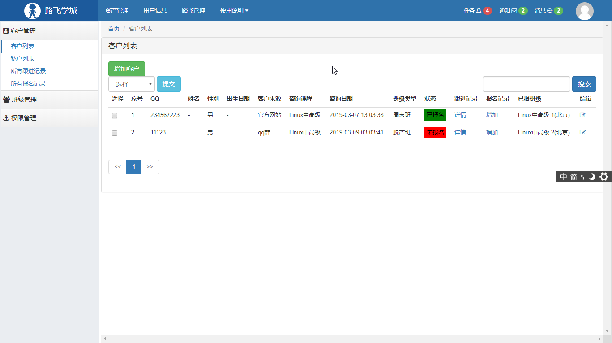
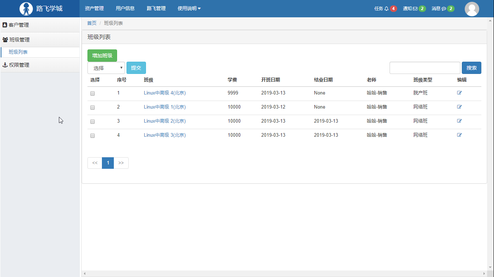
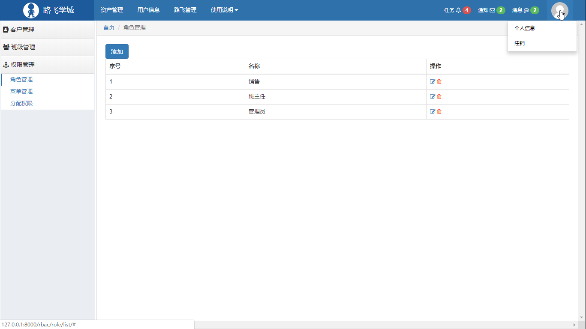
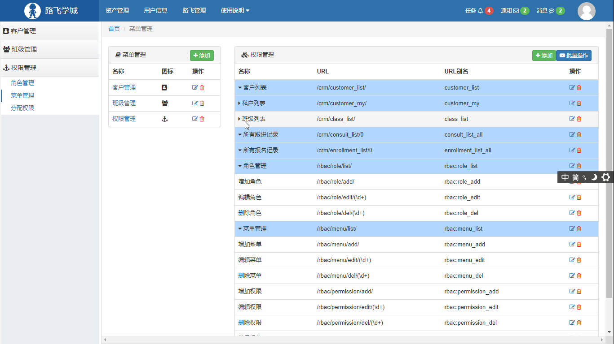
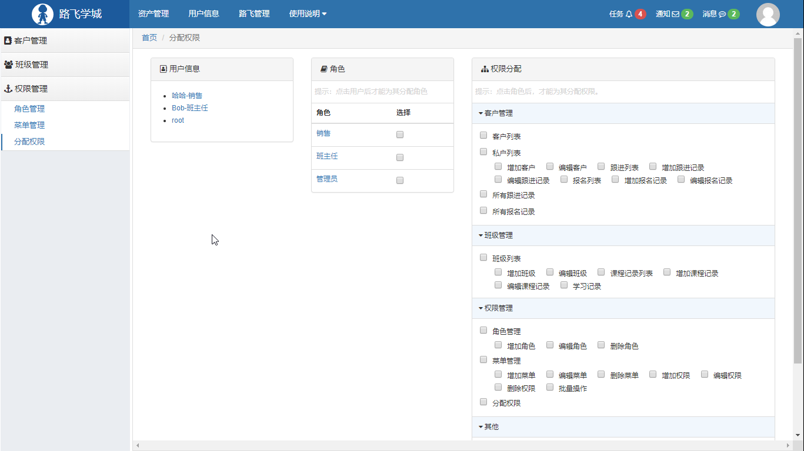

## CRM项目
CRM(customer relationship management)   客户关系管理系统
### 项目简介
本系统使用者有销售、老师、管理员，主要用来管理客户，维护和客户的关系，基于RBAC对使用系统人员进行权限控制，对老师、班级和销售进行统一管理。
### 功能特性
1. 登录
2. 注册
3. 销售：
    1. 客户管理
        1. 增加、编辑客户信息
    2. 跟进的管理
        1. 增加、编辑跟进的信息
    3. 报名记录
        1. 增加和编辑报名记录
4. 讲师：
    1. 班级管理
        1. 增加、编辑班级信息
    2. 课程管理
        1. 增加、编辑课程信息
    3. 上课记录的管理
        1. 增加、编辑课程信息
5. 权限管理
    1. 角色管理
        1. 增加、删除、修改角色
    2. 菜单管理
        1. 增加、删除、修改菜单
    3. 分配权限
        1. 增加、删除、修改用户、角色的权限信息


### 环境依赖
1. python 3.7
1. Django 1.11.18
1. MySQL 5.6.42
1. JQuery 3.3.1
1. Bootstrap 3.3.7
1. Font Awesome 4.7.0

### 部署步骤
1. 修改settings.DATABASES中的数据库配置
2. 将app下migrations除init之外全部删除
3. 数据库迁移，依次执行`python manage.py makemigrations`,`python manage.py migrate`
4. 运行项目，`python manage.py runserver  0.0.0.0:80`
5. 登录django-admin填充数据
6. 登录管理员用户分配权限
7. 测试运行

### 目录结构描述
```text

----------------------------------------------------------
crm_demo:
   |--Alibaba_crm           项目目录             
   |  |--init.py     
   |  |--settings.py        项目配置文件     
   |  |--urls.py            URL根配置     
   |  |--wsgi.py            内置runserver命令的WSGI应用配置     
   |     
   |--crm                   业务逻辑目录                 
   |  |--middleware         中间件
   |  |  |--*
   |  |--migrations         数据库迁移，版本控制         
   |  |  |--*
   |  |--templates          模板文件
   |  |  |--*
   |  |--templatetags       模板中的标签和自定义filter
   |  |  |--*   
   |  |--utils              工具包
   |  |  |--*
   |  |--views              视图
   |  |  |--*
   |  |--admin.py           后台         
   |  |--apps.py            app设置
   |  |--forms.py           表单，用户提交的数据，对数据验证及在模板中输入框的生成
   |  |--models.py          数据库相关，存取数据时用到
   |  |--urls.py            app的url配置
   |  |--test.py            
   |  |--__init__.py
   | 
   |--rbac                  权限控制目录                 
   |  |--middleware         中间件
   |  |  |--*
   |  |--migrations         数据库迁移，版本控制         
   |  |  |--*
   |  |--service            服务器权限信息
   |  |  |--__init__.py     
   |  |  |--permission.py   初始化权限
   |  |  |--routes.py       获取所有url
   |  |--static             静态资源
   |  |  |--*
   |  |--templates          模板文件
   |  |  |--*
   |  |--templatetags       模板中的标签和自定义filter
   |  |  |--*   
   |  |--views              视图
   |  |--admin.py           后台         
   |  |--apps.py            app设置
   |  |--forms.py           表单，用户提交的数据，对数据验证及在模板中输入框的生成
   |  |--models.py          数据库相关，存取数据时用到
   |  |--urls.py            app的url配置
   |  |--icon_spider.py     爬取icon
   |  |--test.py            
   |  |--__init__.py
   | 
   |--static                静态资源目录    
   |  |--* 
   |
   |--templates             模板文件目录                 
   |  |--login.html
   |  |--register.html
   |
   |--manager.py            管理文件
   |
   |--README.md                 

   
----------------------------------------------------------

```

### 项目预览






